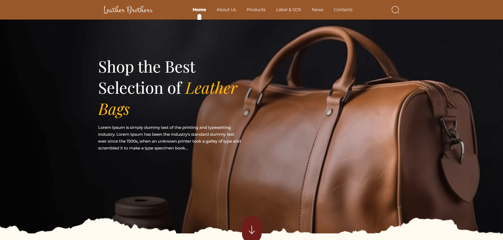
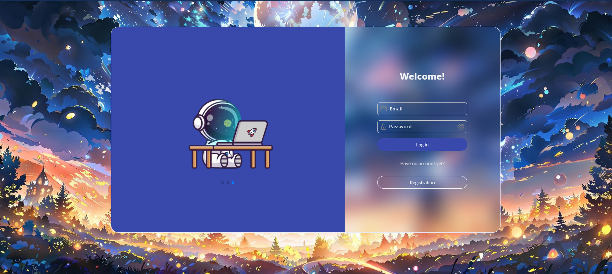

# 👋 Привіт! Я Роман

## 💻 Про мене
Я — **фронтенд-розробник**, який створює адаптивні, сучасні та зручні веб-застосунки. Захоплююся розробкою інтерфейсів, використовую **React, SCSS, Framer-motion, Swiper** та інші сучасні технології.

## 🚀 Мій стек технологій
- **HTML, CSS, SCSS** – семантична верстка, адаптивність та стилізація (рівень знань: Високий)
- **JavaScript (ES6+)** – динаміка та взаємодія (рівень знань: Хороший)
- **React + Vite** – сучасний фреймворк для швидких та ефективних застосунків (рівень знань: Середній)
- **Gulp** – автоматизація процесів розробки (рівень знань: Базовий)
- **Swiper** – створення крутих слайдерів (рівень знань: Хороший)
- **Git/GitHub** – контроль версій та командна робота (рівень знань: Хороший)

## 📌 Останні проєкти
### **Leather Brother** — Сайт-візитка магазину сумок

Leather Brother — сучасний сайт-візитка для магазину сумок, розроблений на **React** з використанням **Vite**. Сайт має адаптивний дизайн та інтерактивні елементи, що дозволяють користувачам зручно переглядати асортимент товарів.

🖥️ [Переглянути проєкт](https://ormd.github.io/leather-brothers-shop/) | 📂 [Репозиторій](https://github.com/OrmD/leather-brothers-shop)
. 

### **Система авторизації користувачів**

Цей проєкт — це веб-додаток з авторизацією користувачів, реалізованою через LocalStorage. Система дозволяє реєструватися, входити в обліковий запис, а також відображати дані користувача на сторінці. Реєстраційні дані зберігаються в LocalStorage, а валідація перевіряє унікальність користувачів.

🖥️ [Переглянути проєкт](https://ormd.github.io/Authorization-site/) | 📂 [Репозиторій](https://github.com/OrmD/Authorization-site)
 
---
## 🌱 Моє навчання та досвід

Я постійно вивчаю нові технології та практики, щоб покращувати свої навички розробки. Моя мета — знайти роботу де я зможу створювати креативні, якісні та надійні інтерфейси для користувачів.

## 📫 Контакти
📧 Email: [groma1535@gmail.com]  
💼 LinkedIn: [https://www.linkedin.com/in/roman-kushnirchuk-a9911427a/]  

⭐ Якщо тобі сподобалися мої роботи – не забудь залишити зірочку у репозиторіях!
---
Інші проєкти можна переглянути нижче.
